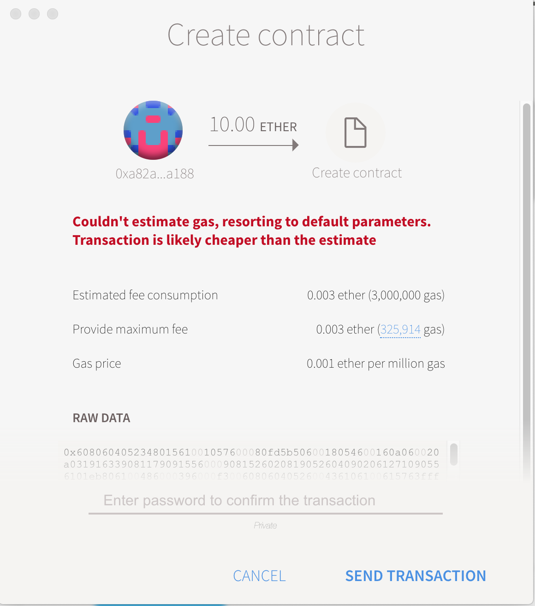
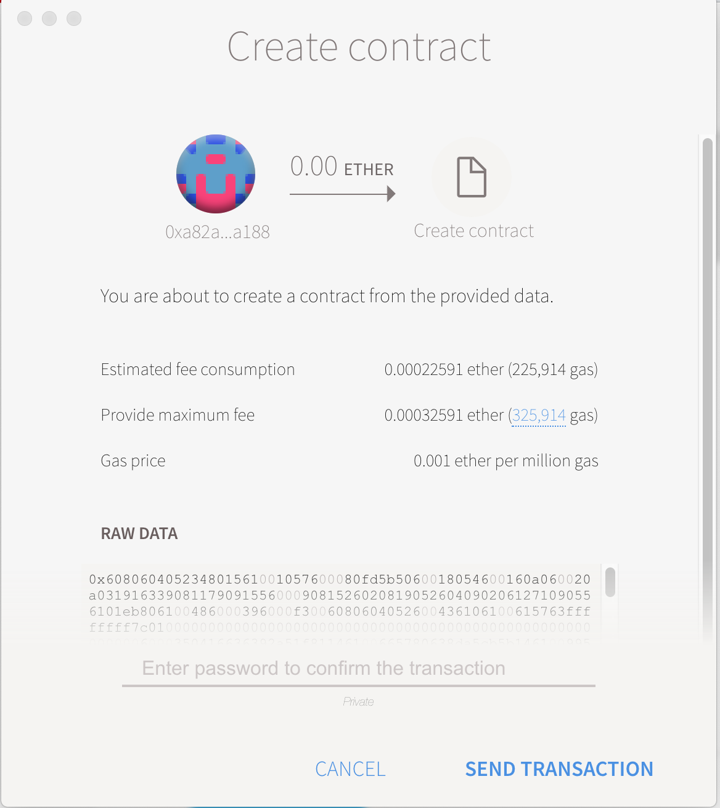
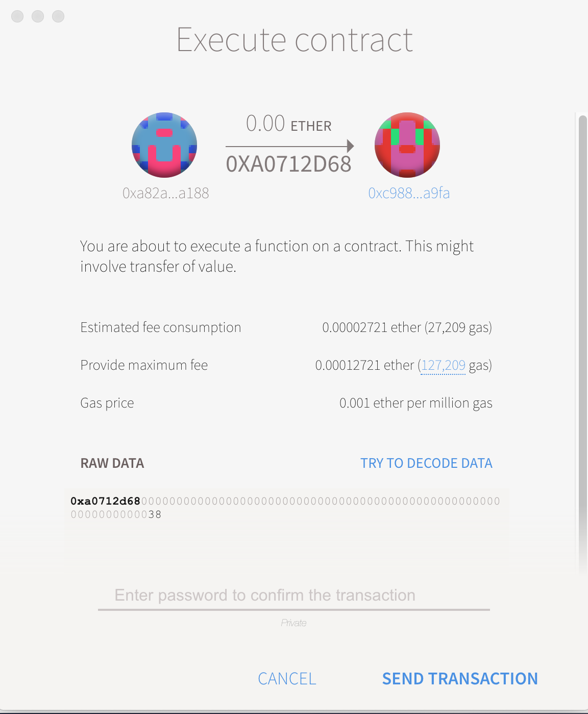

首先需要安装以下依赖：

- [Node.js](https://nodejs.org/) `v7.x` (use the preferred installation method for your OS)
- [Meteor](https://www.meteor.com/install) javascript app framework
- [Yarn](https://yarnpkg.com/) package manager


修改备注：

一、版本更新(注意多语言文件的修改)

1、版本号

2、下载链接

3、md5

跳过更新，下载新版本

"____name__"表示的是app的名称

修改语言文件（interface/i18n/）


interface/client/lib/helpers/helperFunction.js 中的

Helpers.detectNetwork 为绑定网络

检查更新链接设置

modules/clientBinaryManager.js（这个是管geth的）

const BINARY_URL = 'https://raw.githubusercontent.com/ethereum/mist/master/clientBinaries.json';

modules/updateChecker.jso（这个是管mist或wallet的）

https://api.github.com/repos/ethereum/mist/releases/latest 

modules/menuItems.js

https://gitter.im/ethereum/mist

modules/constants.js

https://mainnet.infura.io


目前存在问题

当以--mode  wallet 运行时，在mac下是一片空白。

要在mac 下编译win的安装文件，需要brew install makensis

### Run Mist

打开一个terminal window,输入以下命令:

```
yarn dev:meteor
```

等到出现Client modified -- refreshing 这行内容之后，再另开一个terminal window，输入以下命令

```
yarn dev:electron
```

这个时候，如果能够正常运行起来的话，你将看到mist的窗口了。

进入到meteor-dapp-wallet/app目录下，执行以下命令

```
git submodule update --recursive --init
meteor npm install --save @babel/runtime@7.0.0-beta.49
```

### 转账

在mist中我们可以看到，转账的过程中设计的内容包括：

1. from 从哪个账户转出
2. to把金额转入哪个账户
3. amount 金额的数量
4. data 你可以在这里填入一些额外的信息，这里如果填入要花费钱的（花钱存储）
5. 指定交易费用（多成退，少败吞）

同时看到它有一个可以全部转的功能，要注意的是当全部转的时候，这个全部是指扣除交易费以后的全部，并不是你目前的账户余额。也即是任何一笔交易都是需要花费交易费的。还需要注意的是，当你再data填入内容的时候，它是会变红的，也即是出现了错误，因为这个data的费用是包含中手续费用中的，那就是包含在select fee的值中。所以如果你发现在data中填入数据以后是绿色的，那你可以转账，如果是绿色的，你是不能转账的，你需要的是调整select fee或者调整你的数据长度。而且这个data字段只能填入16进制数据，也即是0x开头的，并且是合法字节的数据。比如0xddd就不是一个合法的字节，0xddd0就是一个合法的字节。

### 部署合约

在mist中，打开contracts界面，在SOLIDITY CONTRACT SOURCE CODE的输入框中可以直接输入solidity编写的合约源码，然后在SELECT CONTRACT TO DEPLOY中选择你需要部署的合约。这里也就是你的contract的名字。选择好了之后，可以调整select fee也即是手续费。接着Deploy即可。当然你也可以给合约转一笔资金，将数量填入AMOUNT字段即可。

当你出现这个情况的时候，你部署不成功的。



当你出现的是这种情况的时候


这样你才能真正可以部署一个合约。

这是合约的一个调用



